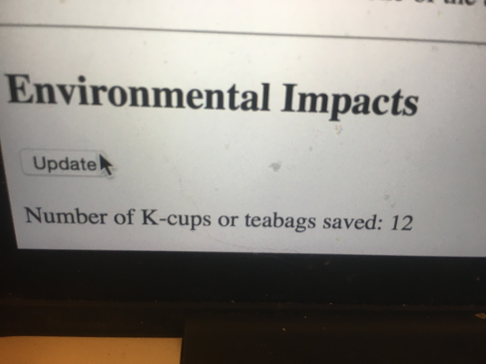
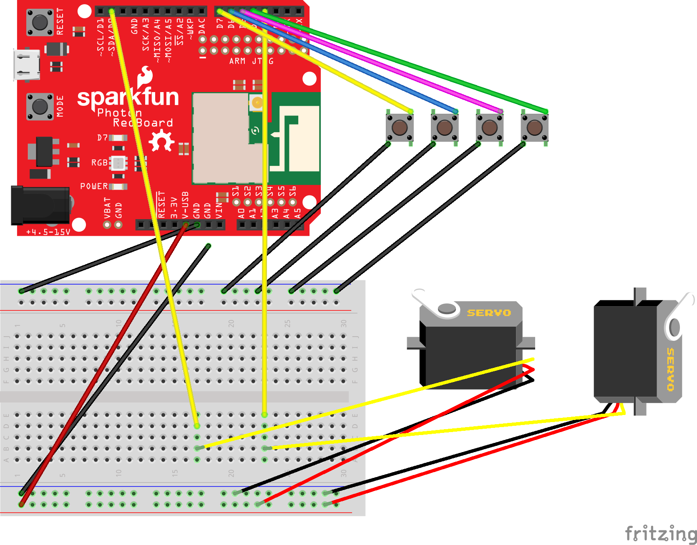
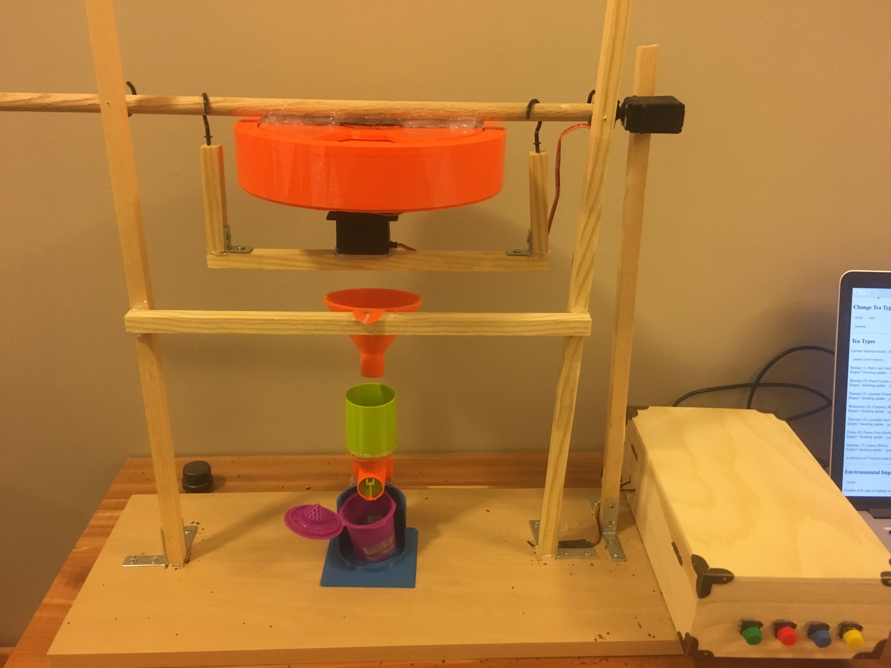
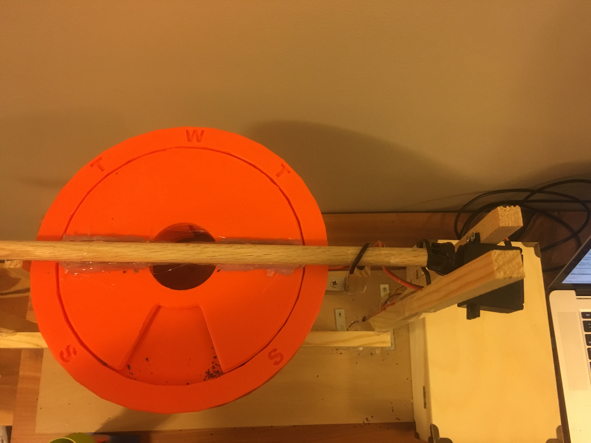
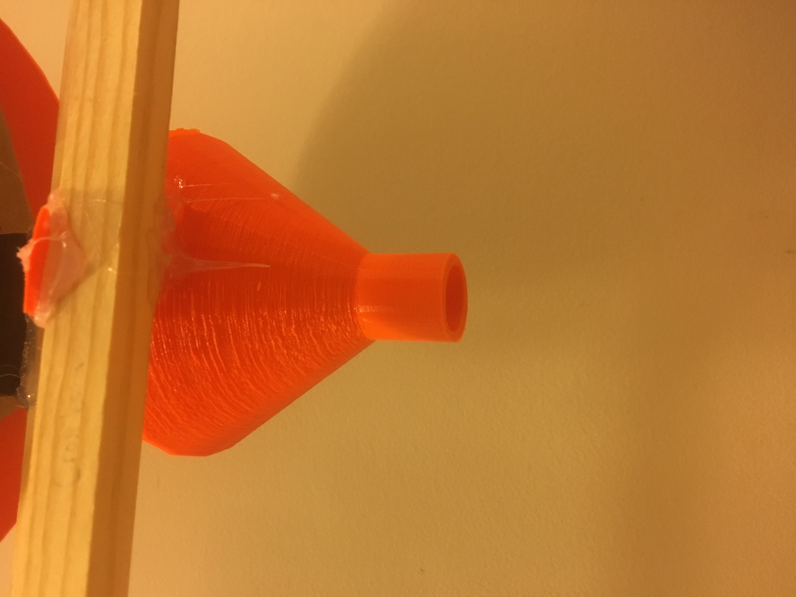
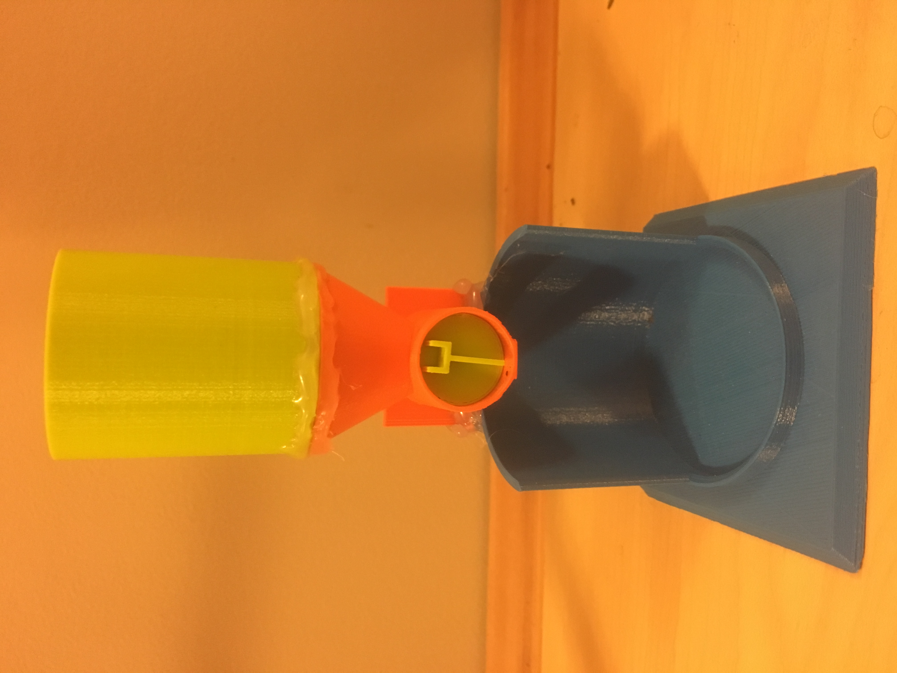
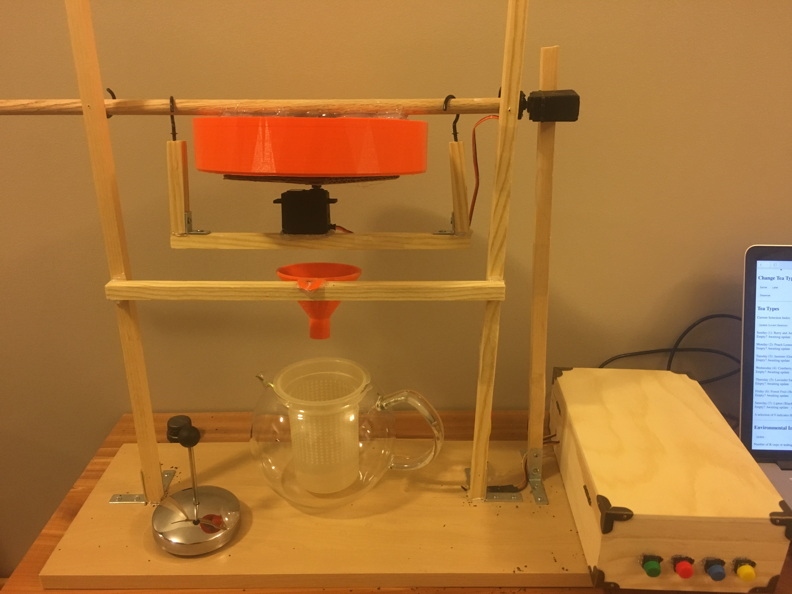

# Final Project - Physical Computing and the Internet of Things

*Name:*  Kate O'Hanlon

*Due Date:* December 14, 2017

## Project: The Varie(tea) Dispenser

The Varie(tea) Dispenser is a tea dispenser to help those who enjoy looseleaf tea save time in the morning. It can hold up to seven types of tea, and provides easy measurement for tea by the pot or by the cup. 

### Detailed Project Description

The Varie(tea) dispenser has three main parts: the rotating holder, the funnel, and the removable single-cup dispenser. 

The rotating holder has seven slots. The intent is to have a week's worth of tea, but they can be used in any order so it can also be used for seven different types to be used and refilled as desired. It can be rotated using buttons on the device or via the accompanying website. There is an eighth spot, which does not hold tea, which it should be set to when not in use to minimize air exposure and potential disruption to the teas. Once the desired slot is selected, one can refill it and optionally* set it as filled, or have it dispense the tea into the funnel. 

The funnel is in place to make use much easier. Since the openings from the slots are so wide, so as to allow the tea to be poured in, it is difficult to place anything to catch all of the tea that pours out. The funnel catches the outflow from the holder and narrows it. It can then flow directly into the infuser of a teapot, or into the included removable single-cup dispenser. 

The dispenser allows the user to have single-cup servings rather than making a whole pot at once, without the need for separate measuring devices. Simply place the infuser or reusable K-cup onto the bed, then turn the handle and it will dispense the amount appropriate for one cup of tea! (Note: This does not work smoothly for tea with large pieces, due to the rotating parts, so it is recommended that this piece only be used for teas without chunks.) 

Together, these increase convenience while cutting down on the environmental impact of frequent tea making. It can save storage space, by allowing seven different types of tea to be stored in one container without mixing, or it can save time on busy mornings by allowing the user to select and pour out the tea in advance, similar to how many adults will mete out their medications for the week all at once. It is also extremely convenient in that it saves measuring; the slots all hold just over one pot of tea, and the dispenser measures one cup's worth for you, so you simply pour in enough to almost fill the slot and there is no need for teaspoons or other measuring devices! Furthermore, by using looseleaf and reusable K-cups or infusers, this cuts down significantly on the garbage usually caused by making tea. Rather than a K-cup, which includes plastic that does not degrade well, or a teabag that will often come with a tag, a staple, and a foil wrapper in addition to the bag itself, these reusable pieces can just be rinsed off and reused. 


*To accomodate users who would rather keep track of which teas are empty or full on their own, and to avoid frustration in case of a power failure resetting filled/empty settings, having the slot set as empty will NOT prevent the tea from dispensing. It will function normally. The filled/empty information is intended to allow those dispsensing remotely to know which teas are available. 


### Technical Description

The hardware can be broken into three categories: 3D-printed, electronic, and wood. 

The three main parts described in the previous section are all 3D-printed. They are all revisions of existing projects from Thingiverse. 
The rotating holder is based off of a [pill dispenser](https://www.thingiverse.com/thing:1538044). The base is largely the same except for resizing. The lid had to be significantly adjusted to allow for easier attachment, both to the frame and to the base of the holder. 
The funnel is a resized version of [this design](https://www.thingiverse.com/thing:13976). 
The one-cup dispenser is an alteration of a [coffee dispenser](https://www.thingiverse.com/thing:739261). After the initial work of calculating the correct scaling to dispense one cup of tea, the smaller size resulted in many problems getting the different pieces to print and fit together. After resizing, it took five prints of the lower assembly to find a rotation and slicing that would not break or have loose filament preventing insertion of the measuring cup. The cup itself took multiple alterations and prints, and even then required significant sanding to fit into the lower assembly. However, compared to other dispensers that were tested, it was still the best for the intended use, and it does [work very well for teas without large chunks (unless it's still stuck from a previous run with chunks)](images/IMG_3866.MOV). 


The electronics consist of a Photon, two servos, four push buttons, and the wires connecting them. The Photon outputs commands to the servo, takes in the inputs from the buttons, and communicates with the site for both commands input and information output. The two servos are both [360 degree servos](https://smile.amazon.com/gp/product/B01F22XS5Y/ref=oh_aui_detailpage_o00_s00?ie=UTF8&psc=1), with one oriented horizontally to rotate the holder to the desired selection, while the other is oriented vertically to dispense the tea from the open slot. Since even at full speed the rotation does not dispense all of the tea, it has to "shake" the container a few times. The push buttons have been explained above; from left to right, they dispense the tea (green), rotate the container left to an earlier date (red), rotate the container right to a later date (blue), and set the selected slot as having been filled (yellow). 

The wood pieces comprise the frame and the case for the Photon. The heart of the frame is three vertical pieces secured by brackets to a shelf. Two of these support the rotating dowel and a crossbeam attached to the funnel, while the third holds the dispensing servo. The dowel is attached to the lid of the container, keeping it in place as the base rotates, and to a smaller frame which holds the selecting servo as well as countering its torque so the container base rotates rather than the main body of ther servo. The final wood piece is the traveling case that acts as a case for the Photon and a base for the pushbuttons. 

The software has largely been described already, with the Photon at the center connecting the servos, buttons, and website. The website has three sections: information about the teas, including the current selection and [whether or not each is empty](images/IMG_3860.MOV); buttons to change the tea selection and then dispense it, where you can confirm your selection in the prior section; and an environmental impact summary, a simple counter of how many K-cups or teabags saved since the device was last powered on with the assumption currently being that the slots are filled each time and thus 4 cups are saved per dispensing. 




#### Hardware Wiring Diagram



The four buttons are in the opposite order from their physical placement to minimize overlap of wires in the diagram. The button color is indicated by the color of the wire connecting it to the Photon. 
The servos are differentiated by their rotation; the horizontal one on the left is the selection servo, and the vertical one on the right is the dispensing servo. 

#### Code

[The code](code/my_code.ino) opens with some global variable declarations, including `teaNum` (the index of the selected tea), `cups` (the number of cups saved so far), and the various values for the button and servo connections. `Setup` then initializes the buttons and servos and publicizes certain functions and variables. The `loop` function waits for inputs from any of the buttons, with a small delay to avoid conflicts between multiple button presses. There are then a variety of functions: `dispenseTea()` controls the dispenser servo; `setEmpty()` sets the current slot to empty, only used after dispensing; `setFull()` sets the current slot to full, controlled by the yellow button; `turnLow()`, `turnLown()`, `turnHigh()`, and `turnHighn()` all control the rotation servo; `remoteDispense()`, `remoteLow()`, and `remoteHigh()` allow the website to trigger their respective functions. 

Getting the dispenser to work took a lot of fiddling. Even now, [it fails to completely dispense the tea a large portion of the time](images/IMG_3858.MOV), which is why the last delay is long enough to allow some added encouragement! 
```c++
int dispenseTea() { 
    dispenser.write(30); //forward
    delay(2*rot45); //rotate just over 90deg
    dispenser.write(85); //stop
    delay(4000); //wait to dispense
    dispenser.write(130); //back
    delay(rot45); //rotate back just over 90deg
    dispenser.write(90); //stop
    dispenser.write(40); //forward
    delay(2.2*rot45); //rotate just over 90deg
    dispenser.write(85); //stop
    delay(2000); //wait to dispense
    dispenser.write(130); //back
    delay(rot45); //rotate back just over 90deg
    dispenser.write(90); //stop
    dispenser.write(40); //forward
    delay(2.2*rot45); //rotate just over 90deg
    dispenser.write(85); //stop
    delay(10000); //wait to dispense
    dispenser.write(140); //back
    delay(1.27*rot45); //rotate back just over 90deg
    dispenser.write(90); //stop
    
    cups = cups + cupsPer; 
    setEmpty(); 
    return 1; 
}
```


### Design / Form



For many elements of the design, the function informed the form by necessity. There were many practical concerns for how to actually dispense the tea, in particular; in order to be able to be both emptied and filled, there usually had to be significant structural challenges (e.g. how to balance something when the center of mass changes) or the tea had to be completely open to the air. Thus, the round design to allow selection without changing the dispensing point was critical, and tilting to dispense rather than pulling a lid or similar was much more appropriate for the intended purpose even if it took more fine-tuning. However, I did consider many designs for this, and eventually settled on one I'd been fortunate to find early on (the pill container) since it had the best appearance and most maximized ease and efficiency of use, furthering the goals of the project. The dispenser was similarly chosen from many design options for its appearance, once the item was narrowed down by its function. 





This means that the main aesthetic choices were made with the woodwork. For all the wood, I elected to leave it bare; it looks much more natural, invoking the origins of the tea and speaking to the environmental goals of the piece, and the added protection was not necessary for most of the design, as the only piece that is likely to come into contact with liquid is the base which does have a water-resistant sealant. For the hooks, I selected a more subtle matte black rather than a shiny version, since they are meant to fade into the project rather than being a focal point. These two color choices together allowed the colors of the 3D-printed pieces and the buttons to pop as well, which draws the gaze to the interactive pieces as intended. Hopefully, this contrast also reminds the user of the plastic and metal that is not being discarded due to the reusable properties of this over teabags or K-cups. 

For the Photon case, it is convienient to open and close while still being secure, but I selected this design over simpler models because for many teas remind them of travel, whether to the impressive tea stores of France and England, the overwhelming plantations of Asia, or anywhere else your imagination might take you! Its bare wood and understated metallic accents also blend in with the look of the rest of the piece. 



### Evaluation / Reflection

For the most part, I am happy with the results of my project. There are certainly some flaws, but for the most part they are much better than they would have been if I didn't explore various options, or they simply were not feasible with the time and resources I had. 

I learned a lot about 3D printing, both specific to the Duke system and not. A Duke-related challenge was the online system; it can sometimes take days of waiting and periodically checking to get a free printer. Outside of Duke, the biggest problem was altering others' work to suit the needs of my project. If they uploaded the .stp files, then some changes could be made, but some detail was lost so most small changes were much harder than when working on a project of one's own. If they only uploaded .stl files, they were almost impossible to change outside of scaling (the x, y, and z axes, or all dimensions at once), which presented numerous challenges but also resulted in inventive and, in the end, more practical solutions. 

My biggest concern that I think I could have fixed was the dispensing servo. The selection servo took a lot of fiddling, but I did eventually get it to almost perfectly consistently select the next slot. The dispensing servo, however, either moved too quickly, throwing tea everywhere, or too slowly, not inducing the tea to pour out, or both. In the end, I chose a middle ground where it "shook" it, minimizing the throwing of tea but still not allowing all the tea to dispense, which I'm rather disappointed in. However, I am still happy that I learned so much about working with servos, both 180 degree ones (testing before ordering and recieving the others) and 360 degree versions with differing torques. Interestingly, the 360 degree ones use the same code as the 180 degree servos, so 0 is full speed forward, 180 is full speed back, and 90 is stop, rather than having degree measurements as with the 180 degree servos. I did not try substituting a 180 degree servo into the project, but I would be interested to see if having degree measurements would make the fine-tuning easier than forward and back impulses. 

For the site, it isn't as pretty as I had hoped, but it did include all the functionality I wanted except the ability to change the names of the teas. You can change the tea type, dispense the selected tea, see what the selection is and if it's full or empty, and see the environmental impact. I had thought about including a randomize button, to select a surprise tea option, but I ended up removing it since it didn't fit with my image of a way to improve the efficiency and environmental impact of a consistent tea habit as opposed to more casual tea drinkers. 

Other than the difficulty with the end result for the dispensing servo, I think all the challenges I faced were excellent learning experiences that had satisfactory results. I don't think I would have done anything significantly differently except, again, the dispensing method, as the project has both form and function that I find appropriate and pleasing and I think they work well together. 
